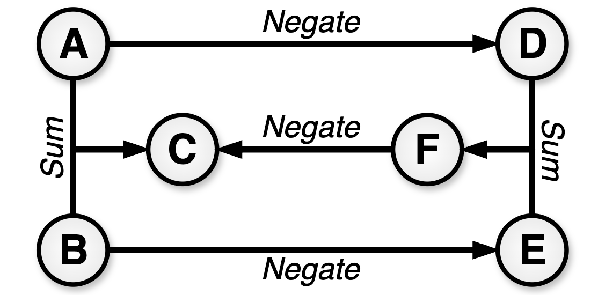

=========================
Very Simple Demonstration
=========================

.. start demo

*Note that this demo is found in* `demos/demo_basic.py <https://github.com/jmorris335/ConstraintHg/blob/main/demos/demo_basic.py>`_

Let's build a basic constraint hypergraph of the following equations, visualized on the right:

* :math:`A + B = C`
* :math:`A = -D`
* :math:`B = -E`
* :math:`D + E = F`
* :math:`F = -C`

|

First, import the classes. 

.. code-block:: python

    from constrainthg.hypergraph import Hypergraph
    import constrainthg.relations as R

A hypergraph consists of edges that map between a set of nodes to a single node. We provide the mapping by defining a constraint function (many of which are already defined in the ``relationships`` module). The two relationships defined in the governing equations are addition and negation. Using the typical syntax, we refer to the functions defined in ``relationships`` with ``R.<name>``, in this case ``R.Rsum`` and ``R.Rnegate``. To make the hypergraph we'll need to compose the 5 edges (equations) given above. 

.. code-block:: python

    hg = Hypergraph()
    hg.add_edge(['A', 'B'], 'C', R.Rsum)
    hg.add_edge('A', 'D', R.Rnegate)
    hg.add_edge('B', 'E', R.Rnegate)
    hg.add_edge(['D', 'E'], 'F', R.Rsum)
    hg.add_edge('F', 'C', R.Rnegate)

We can verify that the hypergraph was made correctly by tracing all possible paths for generating C using the ``printPaths`` function.

.. code-block:: python

    print(hg.summary('C'))

This should give us the following output. Hyperedges are indicated with a `◯`, with the last source separated from other edges with a `●`. ::

    └──C, cost=1
        ├◯─A, cost=0
        ├●─B, cost=0
        └──F, cost=3
            ├◯─D, cost=1
            │  └──A, cost=0
            └●─E, cost=1
                └──B, cost=0

Compute the value of :math:`C` by picking a set of source nodes (inputs), such as :math:`A` and :math:`B` or :math:`A` and :math:`E`. Set values for the inputs and the solver will automatically calulate an optimized route to simulate :math:`C`. 

.. code-block:: python

    print("**Inputs A and E**")
    hg.solve('C', {'A':3, 'E':-7}, to_print=True)
    print("**Inputs A and B**")
    hg.solve('C', {'A':3, 'B':7}, to_print=True)

The output of the above should be::

    **Inputs A and E**  
    └──C= 10, cost=3  
        └──F= -10, cost=2  
            ├──D= -3, cost=1  
            │  └──A= 3, cost=0  
            └──E= -7, cost=0  

    **Inputs A and B**  
    └──C= 10, cost=1  
        ├──A= 3, cost=0  
        └──B= 7, cost=0  

.. end demo

.. :ref:`genindex` \| :ref:`modindex` \| :ref:`Search <search>`